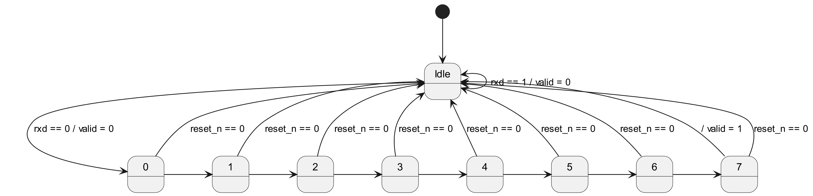

## 4.1.1

## 4.1.2

## 4.1.3

## 4.1.4
Such a pair of states do not exist. There is a main "loop" that includes all the states, which means all states are reachable by all others. The only situation where this would not be the case is if some subset of the states is connected to the rest of the states unidirectionally. Since we have a loop, no such subset exists.

## 4.1.5
valid == 0 and data remains at whatever value it was when reset was triggered.

## 4.1.6
Only idle is included in this check. (Or valid as well if you consider that its own state. Depends if you use Moore or Mealy state machines)

## 4.1.7
We only need n = 2. We think this means all unreachable states in the design (from reset) are a single transition away from a reachable state, meaning if we check for the property holding 2 cycles in the past, we will always have come back to a reachable state before checking the consequent.

## 4.2.1
We couln't get the tool to properly load in the completeness.gfv. It would work once, then stop for 20 minutes before working once more. So we gave up
